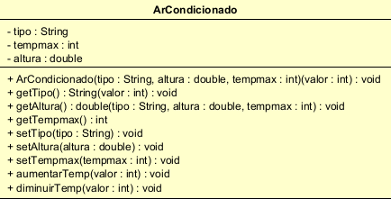

# FiapRide

Sistema simples desenvolvido em **Java** para praticar conceitos de **Programação Orientada a Objetos (POO)**.

---

## Conceitos Aplicados

* Classes
* Objetos
* Instanciação
* Pacotes
* Organização em camadas (`model` / `main`)
* Encapsulamento
* Getters e Setters
* Métodos com regra de negócio
* Alteração de estado do objeto

---

## Estrutura do Projeto

```
src
 └─ br.com.fiapride
     ├─ model
     │   └─ ArCondicionado.java
     └─ main
         └─ SistemaPrincipal.java
```

* **model** → contém as classes que representam objetos do sistema
* **main** → contém a classe responsável por executar o programa

---

# Classe Principal

## ArCondicionado

A classe `ArCondicionado` representa um **aparelho de ar-condicionado no mundo real**.

Ela possui atributos privados e métodos públicos para manipular seus dados de forma segura.

---

## Atributos

* `tipo` → Tipo do ar-condicionado (ex: Split, Teto)
* `altura` → Altura em que o aparelho está instalado
* `tempmax` → Temperatura configurada no aparelho

Todos os atributos são **private**, garantindo o **encapsulamento** e protegendo o estado do objeto.

---

## Construtor

O construtor permite criar um objeto `ArCondicionado` já definindo seus atributos.

```java
ArCondicionado ar = new ArCondicionado("Split", 2.5, 27);
```

---

## Getters e Setters

Os **getters** permitem acessar os valores dos atributos e os **setters** permitem modificá-los de forma controlada.

Exemplo:

```java
ar.setTempmax(24);
int temperatura = ar.getTempmax();
```

### Regra de Negócio no Setter

O método `setTempmax()` possui uma validação:

* A temperatura deve estar entre **16°C e 30°C**

Caso um valor inválido seja informado, o sistema bloqueia a alteração.

---

## Métodos de Comportamento

### aumentarTemp(int valor)

Aumenta a temperatura configurada.

#### Regras:

* O valor deve ser maior que 0
* A temperatura não pode ultrapassar **30°C**

---

### diminuirTemp(int valor)

Diminui a temperatura configurada.

#### Regras:

* O valor deve ser maior que 0
* A temperatura não pode ser menor que **16°C**

---

## Exemplo de Uso

```java
ArCondicionado ar = new ArCondicionado("Split", 2.5, 27);

ar.aumentarTemp(2);   // válido
ar.diminuirTemp(3);   // válido

ar.aumentarTemp(10);  // inválido
ar.diminuirTemp(20);  // inválido

ar.setTempmax(40);    // inválido
ar.setTempmax(24);    // válido
```

---

## Execução

A execução do sistema demonstra:

* Alteração do estado do objeto
* Bloqueio de valores inválidos
* Funcionamento das regras de negócio
* Proteção do estado da classe através do encapsulamento



---

## Tecnologias

* Java 17+
* IntelliJ IDEA
* Astah UML
* Git & GitHub
