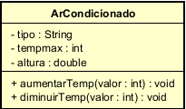

# FiapRide

Sistema simples desenvolvido em **Java** para praticar Programação Orientada a Objetos.

---

## Conceitos Aplicados

* Classes
* Objetos
* Instanciação
* Pacotes
* Organização em camadas (model / main)
* Encapsulamento
* Métodos com regra de negócio
* Alteração de estado do objeto

---

## Classe Principal do Projeto

### ArCondicionado

A classe `ArCondicionado` representa um aparelho de ar-condicionado no mundo real.

### Atributos

* `tipo` → Tipo do ar-condicionado (ex: Split, Teto)
* `altura` → Altura em que o aparelho está instalado
* `tempmax` → Temperatura atual configurada

Os atributos são `private`, garantindo o **encapsulamento** e protegendo o estado do objeto.

---

## Métodos Criados

### aumentarTemp(int valor)

Aumenta a temperatura do aparelho.

#### Regras de negócio:

* O valor deve ser maior que 0
* A temperatura não pode ultrapassar 30°C

Caso a regra seja violada, o sistema exibe uma mensagem de erro.

---

### diminuirTemp(int valor)

Diminui a temperatura do aparelho.

#### Regras de negócio:

* O valor deve ser maior que 0
* A temperatura não pode ser menor que 16°C

Caso a regra seja violada, o sistema exibe uma mensagem de erro.

---

## ▶Exemplo de Uso

```java
ArCondicionado ar = new ArCondicionado("Split", 2.5, 27);

ar.aumentarTemp(2);   // válido
ar.diminuirTemp(5);   // válido

ar.aumentarTemp(10);  // inválido
ar.diminuirTemp(20);  // inválido
```

---

## Execução

A execução demonstra:

* Alteração do estado do objeto
* Bloqueio de valores inválidos
* Funcionamento das regras de negócio



---

## Tecnologias

* Java 17+
* IntelliJ IDEA
* Git & GitHub
